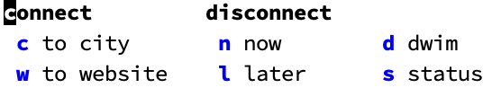

# `mullvad`: Emacs interface for the Mullvad VPN

## Overview

`mullvad` lets you control the [Mullvad VPN](https://mullvad.net/) directly from Emacs. Instead of switching to a terminal or the Mullvad graphical application, you can connect, disconnect, check your VPN status, and set timed disconnections without leaving your editor.

The package is built around the idea that VPN connections are often tied to specific tasks. You configure two association lists: one mapping city names to Mullvad server identifiers, and another mapping website names to cities. When you need to access a geo-restricted service, you select it by name and the package resolves the full chain -- website to city to server -- and connects you automatically.

Timed disconnections are a first-class feature. Every connection can include a duration, after which the package disconnects automatically. This is especially useful for programmatic usage, where you want a VPN connection to last only as long as the operation that needs it. All commands are also callable from Lisp code with explicit arguments, making it straightforward to wrap VPN-dependent operations in advice or hooks.

A `transient` menu groups all commands under a single entry point (`M-x mullvad`), giving you quick access to connect by city or website, disconnect immediately or on a timer, toggle the connection, check status, and list available servers.

## Screenshots



## Installation

`mullvad` requires Emacs 28.1 or later and depends on `transient` (version 0.4 or later). You must also have the [Mullvad CLI](https://mullvad.net/) installed on your system and logged in (`mullvad account login YOUR_ACCOUNT_NUMBER`).

### package-vc (built-in since Emacs 30)

```emacs-lisp
(use-package mullvad
  :vc (:url "https://github.com/benthamite/mullvad"))
```

### Elpaca

```emacs-lisp
(use-package mullvad
  :ensure (:host github :repo "benthamite/mullvad"))
```

### straight.el

```emacs-lisp
(use-package mullvad
  :straight (:host github :repo "benthamite/mullvad"))
```

## Quick start

```emacs-lisp
(use-package mullvad
  :config
  (setopt mullvad-cities-and-servers
          '(("London" . "gb-lon-wg-001")
            ("New York" . "us-nyc-wg-301")))
  (setopt mullvad-websites-and-cities
          '(("Criterion Channel" . "New York")
            ("Library Genesis" . "London")))
  (setopt mullvad-durations '(5 10 30 60))
  (global-set-key (kbd "C-c v") #'mullvad))
```

Run `M-x mullvad` to open the transient menu, then press `w` to connect by website or `c` to connect by city. Use `M-x mullvad-list-servers` to discover available server identifiers for your configuration.

## Documentation

For a comprehensive description of all user options, commands, and functions, see the [manual](README.org).

## License

This package is licensed under the GNU General Public License, version 3 or later. See [COPYING.txt](COPYING.txt) for the full text.
